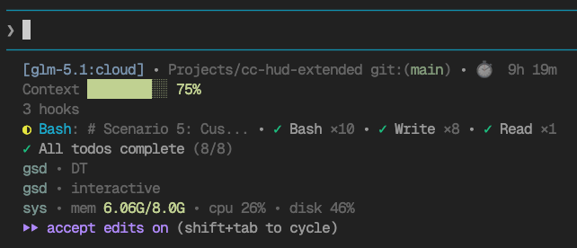
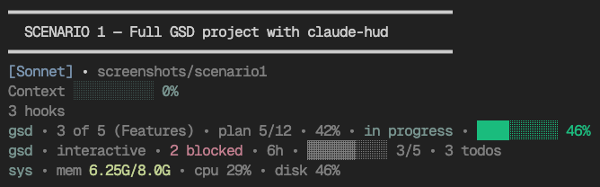
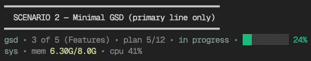
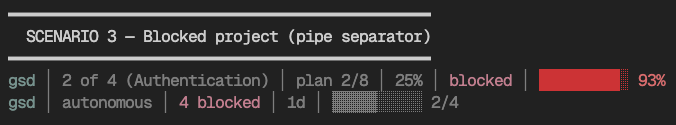
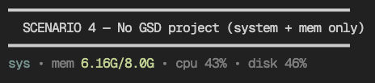

# cc-hud-extended

Modular, extensible statusline extension for [Claude Code](https://code.claude.com).

Adds custom information lines (GSD progress, system metrics, claude-mem state, and more) alongside or without [claude-hud](https://github.com/jarrodwatts/claude-hud).

## Screenshots

**Full GSD project with claude-hud**



**Primary GSD line only**



**Blocked project — pipe separator**



**No GSD project — system + mem only**



**Custom theme — amber labels, box separator**



## Quick Start

```bash
curl -fsSL https://raw.githubusercontent.com/nicolaslima/cc-hud-extended/main/install.sh | bash
```

The installer guides you through selecting which lines and components to enable, then restarts Claude Code.

## Prerequisites

- [x] [Node.js](https://nodejs.org) 18+
- [x] [Claude Code](https://code.claude.com) CLI

## Install

### One-command install (recommended)

```bash
curl -fsSL https://raw.githubusercontent.com/nicolaslima/cc-hud-extended/main/install.sh | bash
```

The installer will:
1. Download the latest release from GitHub
2. Ask which lines to enable (GSD, GSD Detail, Memory, System)
3. Ask which components to show per line
4. Ask the display order of lines
5. Ask about auto-refresh (recommended for system/mem lines)
6. Ask about status line padding
7. Configure `~/.claude/settings.json` automatically
8. Display config file paths when done

### Manual install (from source)

```bash
git clone https://github.com/nicolaslima/cc-hud-extended.git
cd cc-hud-extended
npm install && npm run build
```

Then add to `~/.claude/settings.json`:

```json
{
  "statusLine": {
    "type": "command",
    "command": "node /path/to/cc-hud-extended/dist/index.js",
    "refreshInterval": 30,
    "padding": 2
  }
}
```

### Uninstall

```bash
curl -fsSL https://raw.githubusercontent.com/nicolaslima/cc-hud-extended/main/uninstall.sh | bash
```

## Configuration

Config file: `~/.config/cc-hud-extended/config.json` (or set `CC_HUD_CONFIG` env var to a custom path).

### Example: personalized config

```json
{
  "separator": " • ",
  "colors": { "secondary": "dim" },
  "baseHud": {
    "enabled": true,
    "filterPhaseLine": true,
    "filterMemoryLine": true,
    "separatorReplace": " • "
  },
  "lines": {
    "gsd": {
      "enabled": true,
      "label": "gsd",
      "colors": {
        "label": "#416a63",
        "executing": "#416a63",
        "warning": "#c0d18c",
        "critical": "#a23552"
      },
      "showPhase": true,
      "showPlan": true,
      "showPercent": true,
      "showStatus": true,
      "showTask": true,
      "showContext": false
    },
    "gsd-detail": {
      "enabled": true,
      "label": "gsd",
      "colors": {
        "label": "#416a63",
        "executing": "#416a63",
        "warning": "#c0d18c",
        "critical": "#a23552"
      },
      "showMode": true,
      "showBlockers": true,
      "showPendingTodos": true,
      "showPhaseProgress": true,
      "showLastActivity": true,
      "showUpdates": true
    },
    "mem": {
      "enabled": true,
      "label": "mem",
      "colors": { "label": "#416a63", "ok": "#416a63", "warning": "#c0d18c", "critical": "#a23552" },
      "showProject": true,
      "showObservations": true,
      "showPrompts": true,
      "showSessions": true,
      "showLastActivity": true,
      "showState": true
    },
    "system": {
      "enabled": true,
      "label": "sys",
      "colors": { "label": "#416a63", "warning": "#c0d18c", "critical": "#a23552" },
      "showMemory": true,
      "showCpu": true,
      "showDisk": true
    }
  },
  "lineOrder": ["gsd", "gsd-detail", "mem", "system"]
}
```

### StatusLine settings

The `statusLine` object in `~/.claude/settings.json` supports:

| Field | Type | Description |
|-------|------|-------------|
| `type` | `"command"` | Must be `"command"` |
| `command` | string | Path to the script to run |
| `refreshInterval` | number | Re-run command every N seconds during idle (min 1) |
| `padding` | number | Extra horizontal spacing in characters (default 0) |

Setting `refreshInterval` is recommended when using system or memory lines, since CPU/memory data changes over time even when Claude Code is idle.

### GSD line (primary)

Shows core project status — "where am I right now?"

| Component | Config key | Source | Example output |
|---|---|---|---|
| Phase | `showPhase` | `.planning/STATE.md` | `2 of 5 (Foundation)` |
| Plan | `showPlan` | `.planning/STATE.md` | `plan 3/8` |
| Percent | `showPercent` | `.planning/STATE.md` | `38%` |
| Status | `showStatus` | `.planning/STATE.md` | `in progress` / `blocked` |
| Task | `showTask` | `~/.claude/todos/` | `Fixing GSD visibility` |
| Context | `showContext` | Claude Code payload | `█████░░░░░ 30%` |

### GSD Detail line (secondary)

Shows supplementary project context — "what's around me?"

| Component | Config key | Source | Example output |
|---|---|---|---|
| Mode | `showMode` | `.planning/config.json` | `interactive` / `autonomous` |
| Blockers | `showBlockers` | `.planning/STATE.md` | `2 blocked` |
| Pending Todos | `showPendingTodos` | `.planning/todos/pending/` | `3 todos` |
| Phase Progress | `showPhaseProgress` | `.planning/ROADMAP.md` | `▓▓▓▓░░░░░░ 2/5` |
| Last Activity | `showLastActivity` | `.planning/STATE.md` | `3h` / `2d` |
| Updates | `showUpdates` | GSD update cache | `⬆ update` / `⚠ stale` |

Status colors: `executing` (green), `planning`/`ready` (yellow), `blocked` (red).

### Color tokens

Colors support hex values (`#416a63`) or named tokens (`dim`, `bold`).

### Display order

Change the `lineOrder` array to reorder lines:

```json
{ "lineOrder": ["gsd", "gsd-detail", "system", "mem"] }
```

## Custom Lines

Drop a `.js` file in `~/.config/cc-hud-extended/lines/`:

```js
// ~/.config/cc-hud-extended/lines/time.js
module.exports = {
  id: "time",

  async render(payload, config) {
    const lineConfig = config.lines?.time || {};
    if (lineConfig.enabled === false) return null;

    const now = new Date();
    const time = now.toLocaleTimeString("en-US", { hour: "2-digit", minute: "2-digit" });

    return `🕐 ${time}`;
  },
};
```

Then add `"time"` to `lineOrder` in your config.

### Available payload fields

Your custom line receives the full Claude Code statusline payload. Key fields:

| Field | Description |
|-------|-------------|
| `model.id`, `model.display_name` | Current model |
| `workspace.current_dir`, `workspace.project_dir` | Working and project directories |
| `workspace.added_dirs` | Directories added via `/add-dir` |
| `workspace.git_worktree` | Git worktree name (when in a worktree) |
| `session_id`, `session_name` | Session identifier and custom name |
| `version` | Claude Code version |
| `output_style.name` | Current output style |
| `cost.total_cost_usd` | Total session cost in USD |
| `cost.total_duration_ms`, `cost.total_api_duration_ms` | Elapsed time and API time |
| `cost.total_lines_added`, `cost.total_lines_removed` | Lines of code changed |
| `context_window.used_percentage`, `context_window.remaining_percentage` | Context usage (may be null) |
| `context_window.context_window_size` | Max context size in tokens |
| `context_window.current_usage` | Token counts from last API call (may be null) |
| `context_window.total_input_tokens`, `context_window.total_output_tokens` | Cumulative token counts |
| `exceeds_200k_tokens` | Whether total tokens exceed 200k |
| `rate_limits.five_hour.used_percentage`, `rate_limits.seven_day.used_percentage` | Rate limit usage (may be absent) |
| `vim.mode` | Current vim mode (`NORMAL` or `INSERT`, when vim mode is on) |
| `agent.name` | Agent name (when running with `--agent`) |
| `worktree.name`, `worktree.path`, `worktree.branch` | Worktree info (when in a worktree session) |

## Architecture

```
src/
  index.ts          # Entry point: reads stdin, renders all lines (with 800ms timeout guard)
  core/
    types.ts        # Shared types (StatuslinePayload, LineRenderer, HudConfig)
    config.ts       # Config loader with layered defaults
    stdin.ts        # Stdin reader with 3s timeout guard
    base-hud.ts     # claude-hud bridge (optional, 2s timeout)
  lines/
    index.ts        # Line registry and custom line loader (async import)
    gsd.ts          # GSD primary line (phase, plan, status, task, context)
    gsd-detail.ts   # GSD detail line (mode, blockers, todos, progress, activity, updates)
    gsd-utils.ts    # Shared GSD utilities (project detection, STATE.md parsing, etc.)
    system.ts       # System metrics line (with CPU cache for performance)
    mem.ts          # Claude-mem line (with parallel I/O for performance)
  utils/
    ansi.ts         # Shared ANSI color utilities + OSC 8 hyperlinks
test/
  test.mjs         # Test suite (run with: npm test)
```

## What's New in v1.1.0

- **Complete StatuslinePayload**: All official Claude Code fields now available (rate_limits, session_name, agent, worktree, version, exceeds_200k_tokens, etc.)
- **Performance**: 800ms render timeout guard, CPU sampling cache (5s TTL), parallel I/O in mem line, reduced base-hud timeout to 2s
- **Custom lines ESM fix**: Dynamic `import()` with `pathToFileURL` instead of broken `require()`
- **Errors to stderr**: Error messages no longer appear in the statusline
- **OSC 8 hyperlinks**: Clickable links in terminals that support them (iTerm2, Kitty, WezTerm)
- **System line fallback**: Shows `—` placeholder instead of disappearing when metrics unavailable
- **refreshInterval support**: Installer now offers auto-refresh for system/mem lines
- **Padding support**: Installer now offers horizontal padding configuration
- **Test suite**: 34 tests covering ANSI utilities, config, line renderers, and utils
- **Shell safety**: Improved JSON escaping in install script

## Backward Compatibility

Existing configs without `gsd-detail` will automatically use the defaults (all detail components enabled). The `gsd` line config is also backward-compatible — any `show*` flags that were moved to `gsd-detail` (like `showMode`, `showBlockers`, etc.) are simply ignored if present in the `gsd` config block.

## License

MIT